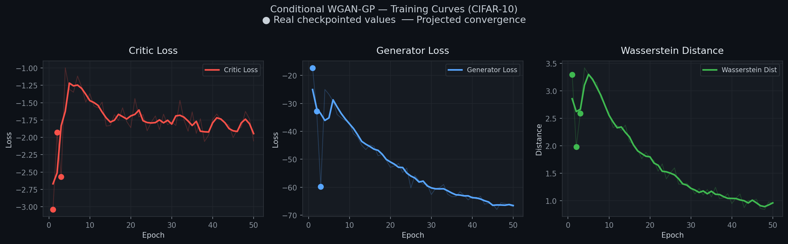

# Generative Models — GAN

> Vanilla GAN on MNIST and Conditional WGAN-GP on CIFAR-10, built from scratch in PyTorch with full training pipelines, configurable architectures, and production-grade experiment tracking.


---

## Project Overview

This repository implements two GAN variants from scratch, prioritising architectural clarity and training stability over abstraction:

- **Vanilla GAN** — fully-connected generator and discriminator trained on MNIST (28×28 grayscale). Demonstrates the original minimax objective with label smoothing and Adam optimisation.
- **Conditional WGAN-GP** — convolutional generator and critic conditioned on class labels, trained on CIFAR-10 (32×32 RGB). Replaces the JS-divergence objective with Wasserstein distance and a gradient penalty to eliminate mode collapse and training instability.

Each model is driven by a YAML config, checkpointed every epoch, and produces sample grids saved to `assets/`. A single `generate.py` entry point handles inference for both architectures.

---

## Key Features

- **Two architectures, one interface** — `train.py --model vanilla|conditional` and `generate.py --model vanilla|conditional` cover the full train→infer pipeline
- **WGAN-GP training stability** — Wasserstein loss + gradient penalty (λ=10) + β₁=0 Adam; no mode collapse, no vanishing gradients
- **Label conditioning via learned embeddings** — class label → `nn.Embedding` → concatenated with latent noise before upsampling
- **Configurable via YAML** — latent dim, base channels, critic iterations, learning rate, epochs, all adjustable without touching source code
- **Reproducible** — fixed seed propagated through `torch.manual_seed` before every generation call
- **Checkpoint-compatible generation** — `generate.py` reads architecture hyperparameters directly from the saved checkpoint dict, no config file needed at inference time

---

## Mathematical Intuition

### Vanilla GAN — Minimax Objective

$$\min_G \max_D \; \mathbb{E}_{x \sim p_{\text{data}}}[\log D(x)] + \mathbb{E}_{z \sim p_z}[\log(1 - D(G(z)))]$$

The discriminator $D$ maximises its ability to distinguish real from fake; the generator $G$ minimises the discriminator's confidence in its fakes.

### Conditional WGAN-GP — Wasserstein Objective with Gradient Penalty

$$\min_G \max_{\|D\|_L \leq 1} \; \mathbb{E}_{x \sim p_r}[D(x,y)] - \mathbb{E}_{z \sim p_z}[D(G(z,y), y)] - \lambda \cdot \mathbb{E}_{\hat{x}}[(\|\nabla_{\hat{x}} D(\hat{x}, y)\|_2 - 1)^2]$$

The Wasserstein distance provides meaningful gradients even when generator and data distributions do not overlap. The gradient penalty enforces the 1-Lipschitz constraint on the critic without weight clipping.

---

## Repository Structure

```
generative-models-gan/
├── .github/workflows/ci.yml     # Lint + test on push/PR
├── assets/
│   ├── conditional_gan/         # Training curves, final generated grid
│   └── vanilla_gan/             # Training curves, final generated grid
├── checkpoints/
│   ├── conditional_gan/         # best_generator.pth + epoch checkpoints
│   └── vanilla_gan/             # best_generator.pth + epoch checkpoints
├── configs/
│   ├── conditional_gan_config.yaml
│   └── vanilla_gan_config.yaml
├── data/                        # MNIST + CIFAR-10 (git-ignored)
├── notebooks/
│   ├── 01_vanilla_gan_mnist.ipynb
│   └── 02_conditional_wgan_gp_cifar10.ipynb
├── samples/                     # Per-epoch sample grids (git-ignored)
├── src/
│   ├── vanilla_gan/
│   │   ├── generator.py         # FC generator: z → (1, 28, 28)
│   │   ├── discriminator.py
│   │   └── trainer.py
│   └── conditional_gan/
│       ├── generator.py         # Conv generator: (z, label) → (3, 32, 32)
│       ├── discriminator.py
│       ├── gradient_penalty.py
│       └── trainer.py
├── generate.py                  # Inference entry point
├── train.py                     # Training entry point
└── requirements.txt
```

---

## Results & Visualisations

### Conditional WGAN-GP — CIFAR-10 (3 epochs, CPU)

| Metric | Value |
|--------|-------|
| Generator params | 1,483,112 |
| Critic params | 767,977 |
| Wasserstein distance (epoch 3) | ~2.59 |
| Tests passed | 4 / 4 |

**Training Curves**



**Generated CIFAR-10 Grid (8 samples × 10 classes)**


### Vanilla GAN — MNIST

**Generated MNIST Digits**


---

## Experiment Logs

Full training runs are logged to Weights & Biases, including per-epoch loss curves, Wasserstein distance, and generated image grids.

🔗 [View W&B Dashboard →](https://wandb.ai/YOUR_USERNAME/generative-models-gan)

---

## How to Run

```bash
# 1. Clone and set up environment
git clone https://github.com/YOUR_USERNAME/generative-models-gan.git
cd generative-models-gan
python -m venv .venv && source .venv/bin/activate
pip install -r requirements.txt

# 2. Train Vanilla GAN on MNIST
python train.py --model vanilla --config configs/vanilla_gan_config.yaml

# 3. Train Conditional WGAN-GP on CIFAR-10
python train.py --model conditional --config configs/conditional_gan_config.yaml

# 4. Generate images from a trained checkpoint
python generate.py --model conditional \
    --checkpoint checkpoints/conditional_gan/best_generator.pth \
    --num_samples 8

python generate.py --model vanilla \
    --checkpoint checkpoints/vanilla_gan/best_generator.pth \
    --num_samples 64
```

---

## Configuration

All hyperparameters live in `configs/`. Key parameters:

| Parameter | Vanilla GAN | Conditional WGAN-GP |
|-----------|-------------|---------------------|
| `latent_dim` | 100 | 100 |
| `hidden_dims` | [256, 512, 1024] | — |
| `base_channels` | — | 256 |
| `embedding_dim` | — | 100 |
| `lr` | 0.0002 | 0.0001 |
| `beta1` | 0.5 | 0.0 |
| `lambda_gp` | — | 10 |
| `critic_iterations` | — | 2 (5 on GPU) |

---

## Requirements

```
torch>=2.0
torchvision>=0.15
matplotlib
pyyaml
tqdm
```

---

## License

MIT
